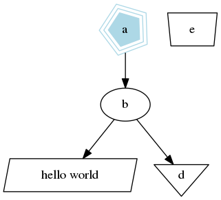
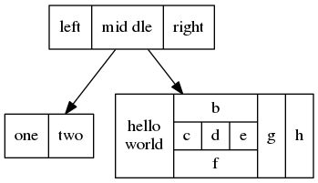
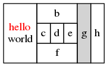

+++
title = "DOT语言教程"
description = ""
date = 2019-08-27
draft = false
in_search_index = true
[taxonomies]
categories = ["工具"]
+++

Graphviz是我很喜欢的一个可视化工具, 它使用dot语言来描述节点以及节点间的关系, 在需要自动化画图的时候用处很大，话说即使是手动使用dot画图，强大的也让人感动。
<!-- more --> 
废话不多说，先上一波graphviz生成的图片。

| | |
|:----:|:----:|
||
|*图1: 多边形节点*|*图2: record型节点*|
|||
|*图3: html样式的label*||

## DOT文件内容
### digraph常用属性
### node类型以及常用属性
### edge常用属性
## 参考链接

