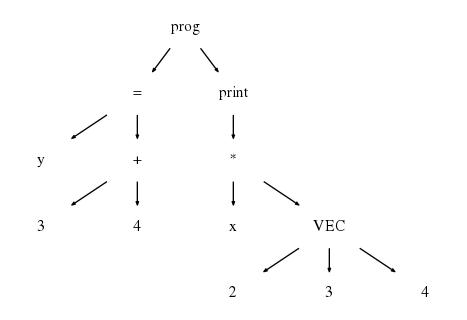

+++
title = "笔记: 编程语言实现模式-树文法"
description = "ANTLR3中的树文法介绍，以及在ANTLR4中的尝试替代方案"
date = 2019-08-27
draft = false
in_search_index = true
[taxonomies]
categories = ["读书笔记", "笔记", "编译"]
+++

["编程语言实现模式"](https://www.amazon.com/Language-Implementation-Patterns-Domain-Specific-Programming/dp/193435645X)讲解了构建语言应用所需的实用型编译技术， 是一本不可多得的好书。唯一遗憾的是书中使用ANLTR3作为教程。而ANTLR4与ANTLR3相比有很大的变化，在降低文法书写难度等方面有很大改进，不过文法与之前版本的文法并不兼容"。书中从第6章起，内容都是基于ANTLR3的，所以这里尝试将书中使用ANTLR3实现的功能用ANTLR4来重构。书中的代码可以在[这里](https://pragprog.com/titles/tpdsl/source_code)下载, 本文中使用到的所有代码都可以在书中的代码找到。

本文中尝试重构的是"5.3 根据文法自动生成访问器"中的内容。

# 使用ANTLR3文法构建AST
## ANTLR3的普通文法规则
书中的4.4节介绍了“使用ANTLR文法构建AST”的方法。在ANTLR3中，如果不使用树文法或语法动作, 是无法创建AST的，只能生成一个验证词法和语法是否正确的解析器。以下面的ANTLR3文法为例，在文法产生的[Parser](VecMathParser.java)中, 每条规则对应的函数返回值为void, 如`public final void prog() throws RecognitionException`, 这时Parser只能验证输入是否合乎语法规则，做不了其他事情。 想要生成AST的话，就要使用树文法了(当然，不嫌麻烦的话使用规则动作也行)。

*VecMath文法*
```bash
// filename: IR/Vec/VecMath.g
grammar VecMath;

// START: stat
prog : stat+ ;    // match multiple statements
stat: ID '=' expr     // match an assignment like "x=3+4"
    | 'print' expr    // match a print statement like "print 4"
    ;
// END: stat
		
// START: expr
	expr:   multExpr ('+' multExpr)* ;       // E.g., "3*4 + 9"
multExpr: primary (('*'|'.') primary)* ; // E.g., "3*4"
primary
        :   INT                              // any integer
	    |   ID                               // any variable name
	    |   '[' expr (',' expr)* ']'        // vector literal; E.g. "[1,2,3]"
	    ;
// END: expr
						
ID  :   'a'..'z'+ ;
INT :   '0'..'9'+ ;
WS  :   (' '|'\r'|'\n')+ {skip();} ;

```

## 使用ANTLR3文法生成AST
ANTLR3内置了一些辅助构建AST的功能。 在options中将output设置为AST后，ANTLR就会给每个规则方法增加返回值tree, 启始规则会返回整个树的根节点。以下面4.4和5.3节中VecMath文法为例，Parser的每条规则函数会变成形如`public final VecMathASTParser.prog_return prog() throws RecognitionException`的形式, 调用Parser.prog()后，便能得到AST的root节点。这里, AST的结构是通过文法定义的。比如根据规则"stat: ID '=' expr -> ^('=' ID expr)", 解析器在匹配"ID '=' expr"语法结构时，会**顺便**构建根节点为'=', 子节点为'ID和'expr'的AST子树，具体的构建过程可以看一下[VecMathASTParser.java](VecMathASTParser.java)代码。对于下面的"VecMath输入", VecMathAST文法构建出的AST如图1所示。

*VecMath输入*
```
x = 3+4
print x * [2, 3, 4]
```
||
|:----:|
||
|*图1*|

*VecMathAST文法*
```bash
// 文件名: IR/Vec/VecMathAST.g
// START: header
grammar VecMath;
options {output=AST;} // we want to create ASTs
tokens { VEC; }       // define imaginary token for vector literal
// END: header

// START: stat
prog : stat+ ;                         // build list of stat trees
stat : ID '=' expr  -> ^('=' ID expr)  // '=' is operator subtree root
     | 'print' expr -> ^('print' expr) // 'print' is subtree root
     ;
// END: stat
	
// START: expr
expr : multExpr ('+'^ multExpr)* ;     // '+' is root node

multExpr 
    :   primary (('*'^|'.'^) primary)*  // '*', '.' are roots
    ;
		    
primary
    :   INT
    |   ID
    |   '[' expr (',' expr)* ']' -> ^(VEC expr+)
    ;
// END: expr

ID  :   'a'..'z'+ ;
INT :   '0'..'9'+ ;
WS  :   (' '|'\r'|'\n')+ {skip();} ;
```

# 使用ANTLR3树文法构建AST外部访问者
有了AST后, ANTLR3可以使用"树文法"来构建AST的外部访问者，所外"外部访问者"，是指访问过程不是在语法解析过程中进行的，而是独立于语法解析过程，是在有了AST之后，一个单独对AST进行访问的过程。 "树文法"与普通文法在语法规则上几乎没什么两样，区别: "树文法"以^开头。此外，两者产生的解析器的"输入"也不相同。对于普通的解析器，输入为词法解析器产生的词法token流; 而对于树文法解析器，它的输入是AST。5.3节中的树文法如下所示。有关`@members {}`等语法，请参照"The Definitive ANTLR4 Reference"。

这里解释一下"stat:   ^('=' ID  {print($ID.text+" = ");} expr) {print("\n");}", "^('=' ID expr)"这种语法: 匹配以"="为根节点，以'ID'和expr为子节点的AST子树，`{print(ID.text+" = ");}` 为“动作”, "ID {print($ID.text + " = ")}"表示在访问完"ID"节点后执行"{print($ID.txt + " = ")}"。

*Print.g树文法*
```bash
// filename: walking/tree-grammar/Print.g
tree grammar Printer; // this grammar is a tree grammar called Printer
options {
    tokenVocab=VecMath;      // use token vocabulary from VecMath.g
    ASTLabelType=CommonTree; // use homogeneous CommonTree for $ID, etc.
}
@members { void print(String s) { System.out.print(s); } }
// END: header
		
// START: prog
prog:   stat+ ; // match list of statement subtrees
// match trees like ('=' x 1) and ('print' ('+' 3 4))
stat:   ^('=' ID  {print($ID.text+" = ");} expr) {print("\n");}
    |   ^('print' {print("print ");}       expr) {print("\n");}
    ;
// END: prog
				
// START: expr
expr:   ^('+' expr {print("+");} expr)
    |   ^('*' expr {print("*");} expr)
    |   ^('.' expr {print(".");} expr)
    |   ^(VEC {print("[");} expr ({print(", ");} expr)* {print("]");})
    |   INT {print($INT.text);}
    |   ID  {print($ID.text);}
	;
// END: expr		
```

# 使用ANTLR4构建AST
ANTLR4构建AST的方式与ANTLR4有很大的不同，ANTLR4的解析器会自动返回'语法解析树'， 解析树的节点类型含有全部的语法规则名和词法规则名。并且, ANLTR4提供了遍历解析树的‘listener’和'visitor'。想要进一步构建AST或根据解析树做其他操作的话，可以直接使用'listener'或'visitor'，在遍历解析树的同时添加自己的操作逻辑即可。

注意，ANTLR4的语法文件以.g4结尾，语法和ANLTR4也不一样。具体的请参照"The Definitive ANTLR 4 Reference"。上面的VecMath.g用ANTLR4的语法重写之后的内容见下面"VecMath ANTLR4语法"。对于上节的"VecMath输入", ANTLR4 解析器产生的"语法解析树"见图2。对比图1和图2，AST比"语法解析树"要简洁很多。

*VecMath ANTLR4语法*
```bash
grammar VecMath;

prog    : stat+ ;
stat    : ID '=' expr
        | 'print' expr
        ;
				
expr    : multExpr ('+' multExpr)* ;
multExpr: primary (('*'|'.') primary)* ;
primary : INT
        | ID
        | '[' expr (',' expr)* ']'
        ;
										
ID : 'a'..'z'+ ;
INT: '0'..'9'+ ;
WS: (' '|'\r'|'\n')+ -> skip ;
```
||
|:----:|
||
|*图2*|

# 使用ANTLR4构建AST访问者
ANTLR4并没有提供对AST访问的"树文法"，都得靠自己。

# 结论
所以，ANTLR4中是没有树文法的。不过有了"解析树"后，想要生成AST就不难了。有了AST后，想要遍历AST的话，也要充分发挥"自己动手"的精神，手工写遍历方法。
